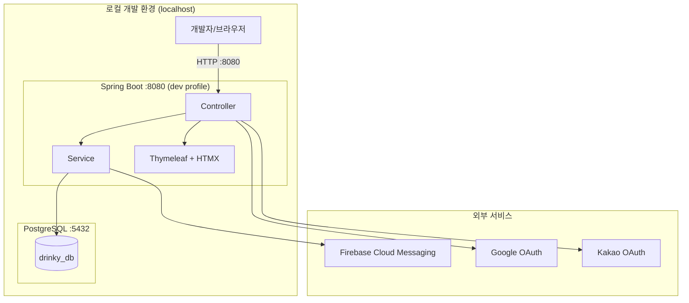
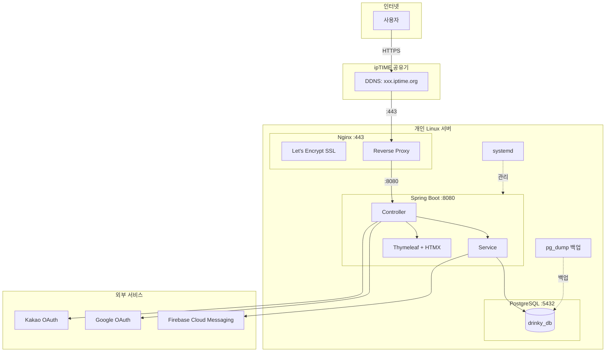
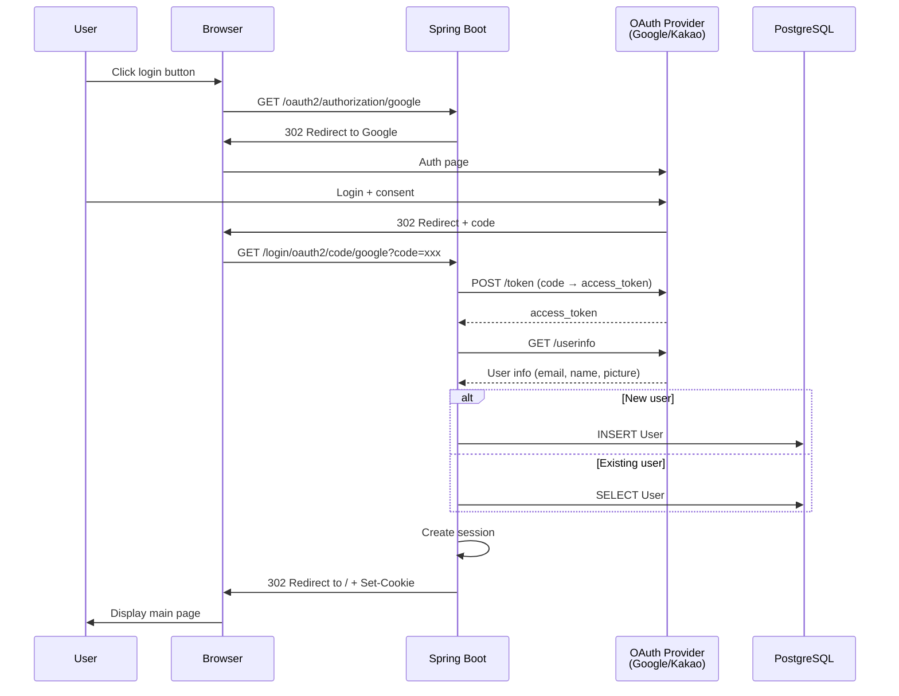
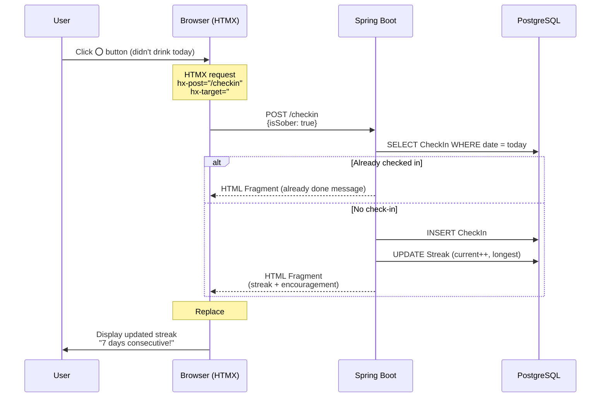
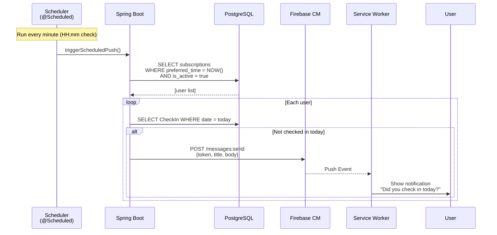

# Drinky Architecture Document

> **Version:** 1.0.0
> **Last Updated:** 2026-01-23
> **Author:** Winston (Architect Agent)

---

## Table of Contents

1. [Introduction](#1-introduction)
2. [High-Level Architecture](#2-high-level-architecture)
3. [Tech Stack](#3-tech-stack)
4. [Data Models](#4-data-models)
5. [Components](#5-components)
6. [External APIs](#6-external-apis)
7. [Core Workflows](#7-core-workflows)
8. [Database Schema](#8-database-schema)
9. [Source Tree](#9-source-tree)
10. [Infrastructure & Deployment](#10-infrastructure--deployment)
11. [Error Handling Strategy](#11-error-handling-strategy)
12. [Coding Standards](#12-coding-standards)
13. [Test Strategy](#13-test-strategy)
14. [Security](#14-security)
15. [Next Steps](#15-next-steps)

---

## 1. Introduction

이 문서는 **Drinky**의 전체 프로젝트 아키텍처를 설명합니다. 백엔드 시스템, 공유 서비스, UI 관심사를 포함하며, AI 기반 개발의 아키텍처 청사진 역할을 합니다.

Drinky는 **PWA 기반 음주 기록 애플리케이션**으로, 간단한 O/X 체크인, 스트릭 추적, 격려 푸시 알림을 통해 절주를 돕는 앱입니다.

### Starter Template

- **선택:** Vite React TypeScript 공식 템플릿 기반 → **Thymeleaf + HTMX로 변경**
- **이유:** 1인 개발자 MVP 프로젝트로 단일 코드베이스가 유리

### Change Log

| Date | Version | Description | Author |
|------|---------|-------------|--------|
| 2026-01-23 | 1.0.0 | Initial architecture document | Winston |

---

## 2. High-Level Architecture

### 2.1 Technical Summary

Drinky는 **Kotlin + Spring Boot 기반 모놀리식 아키텍처**를 채택합니다. 개발 단계에서는 **로컬 환경(localhost)**에서만 동작하며, 로컬 PostgreSQL이 데이터를 저장합니다. Thymeleaf + HTMX로 서버 사이드 렌더링을 하며, 푸시 알림은 Firebase Cloud Messaging을 활용합니다. 인증은 Spring Security + OAuth2로 Google/Kakao 소셜 로그인을 지원합니다.

> **배포 전략:** 개발이 완료된 후 개인 Linux 서버(Nginx + systemd)로 배포 파이프라인을 구성합니다. 배포 관련 스크립트와 설정은 사전 준비 완료 상태입니다.

### 2.2 High-Level Overview

| 항목 | 선택 | 근거 |
|------|------|------|
| **아키텍처 스타일** | 모놀리식 REST/SSR | MVP 복잡도 최소화, 추후 분리 가능 |
| **저장소 구조** | 단일 프로젝트 | 프론트/백 통합 (Thymeleaf) |
| **백엔드** | Kotlin + Spring Boot 3.x | 성숙한 생태계, 강력한 타입 시스템 |
| **프론트엔드** | Thymeleaf + HTMX | 단순한 구조, 빠른 개발 |
| **호스팅** | 로컬 개발 환경 (개발 완료 후 개인 Linux 서버 배포 예정) | 개발 집중, 비용 절감 |
| **인증** | Spring Security + OAuth2 | 세션 기반, 소셜 로그인 |

### 2.3 Architecture Diagram (로컬 개발 환경)



### 2.4 Production Architecture Diagram (개발 완료 후 배포 시)

> 아래 다이어그램은 개발 완료 후 운영 환경 배포 시 적용될 구조입니다.



### 2.5 Architectural Patterns

| 패턴 | 설명 | 근거 |
|------|------|------|
| **레이어드 아키텍처** | Controller → Service → Repository | Spring Boot 표준, 관심사 분리 |
| **Repository 패턴** | Spring Data JPA 활용 | 데이터 접근 추상화, 테스트 용이 |
| **세션 기반 인증** | Spring Security + OAuth2 | Thymeleaf와 자연스러운 통합 |
| **DTO 패턴** | 요청/응답 객체 분리 | API 계약 명확화, 보안 |
| **PWA 패턴** | Service Worker 오프라인 지원 | "앱처럼 사용" 요구사항 |

---

## 3. Tech Stack

이 섹션은 **전체 프로젝트의 기술 선택 기준**입니다. 모든 문서와 개발이 이 테이블을 참조합니다.

### 3.1 Cloud Infrastructure

| 항목 | 선택 | 상세 |
|------|------|------|
| **호스팅** | 개인 Linux 서버 | 데스크탑 서버 |
| **웹서버** | Nginx | 리버스 프록시 + SSL |
| **DDNS** | ipTIME DDNS | 동적 IP 대응 |
| **SSL** | Let's Encrypt | 무료 HTTPS |
| **DB** | PostgreSQL 16 | 로컬 설치 |

### 3.2 Backend + Frontend (Integrated)

| Category | Technology | Version | Purpose |
|----------|------------|---------|---------|
| **Language** | Kotlin | 1.9.22 | Backend development |
| **Runtime** | JVM (Corretto) | 21 LTS | Java runtime |
| **Framework** | Spring Boot | 3.2.2 | Web framework |
| **Template** | Thymeleaf | 3.1.2 | Server-side rendering |
| **Dynamic UI** | HTMX | 1.9.10 | AJAX replacement |
| **Mini JS** | Alpine.js | 3.13.3 | Simple interactions |
| **Styling** | TailwindCSS | 3.4.1 | Utility CSS |
| **Icons** | Lucide | 0.309.0 | SVG icons |
| **Build Tool** | Gradle | 8.5 | Build/dependency management |
| **ORM** | Spring Data JPA | 3.2.2 | Data access |
| **Auth** | Spring Security | 6.2.1 | Session-based auth |
| **OAuth** | OAuth2 Client | 6.2.1 | Google/Kakao login |
| **PWA** | Workbox | 7.0.0 | Service Worker |
| **Test** | JUnit 5 + MockK | 5.10.1 / 1.13.9 | Testing |

### 3.3 Infrastructure

#### 현재 (로컬 개발 환경)

| Category | Technology | Purpose |
|----------|------------|---------|
| **Runtime** | Spring Boot embedded Tomcat | 로컬 개발 서버 (:8080) |
| **Database** | PostgreSQL 16 (local) | 로컬 데이터 저장 |
| **CSS Build** | TailwindCSS CLI | `npm run watch:css` 실시간 빌드 |

#### 향후 (개발 완료 후 배포 시)

| Category | Technology | Purpose |
|----------|------------|---------|
| **Web Server** | Nginx | Reverse proxy + SSL |
| **Process Manager** | systemd | Service management |
| **Backup** | pg_dump + cron | Daily backup |
| **CI/CD** | GitHub Actions | Auto deployment |

### 3.4 External Services

| Service | Purpose | Cost |
|---------|---------|------|
| **Firebase Cloud Messaging** | Push notifications | Free |
| **Google OAuth** | Social login | Free |
| **Kakao OAuth** | Social login | Free |

---

## 4. Data Models

### 4.1 Entity Relationship Diagram

```mermaid
erDiagram
    users ||--o{ check_ins : "기록"
    users ||--o| streaks : "보유"
    users ||--o{ push_subscriptions : "등록"

    users {
        uuid id PK
        varchar email UK
        varchar nickname
        varchar provider
        varchar provider_id
        varchar profile_image
        timestamp created_at
        timestamp updated_at
    }

    check_ins {
        uuid id PK
        uuid user_id FK
        date check_date
        boolean is_sober
        varchar note
        timestamp created_at
    }

    streaks {
        uuid id PK
        uuid user_id FK_UK
        int current_streak
        int longest_streak
        date streak_start_date
        date last_check_date
        timestamp updated_at
    }

    push_subscriptions {
        uuid id PK
        uuid user_id FK
        varchar fcm_token
        varchar device_info
        boolean is_active
        time preferred_time
        timestamp created_at
        timestamp updated_at
    }
```

### 4.2 User (사용자)

**Purpose:** 사용자 계정 및 OAuth 인증 정보 관리

| Attribute | Type | Description | Constraint |
|-----------|------|-------------|------------|
| `id` | UUID | Primary key | PK, auto-generated |
| `email` | VARCHAR(255) | Email address | UNIQUE, NOT NULL |
| `nickname` | VARCHAR(50) | Display name | NOT NULL |
| `provider` | VARCHAR(20) | OAuth provider | 'GOOGLE' \| 'KAKAO' |
| `provider_id` | VARCHAR(255) | OAuth unique ID | NOT NULL |
| `profile_image` | VARCHAR(500) | Profile image URL | NULLABLE |
| `created_at` | TIMESTAMP | Created datetime | NOT NULL |
| `updated_at` | TIMESTAMP | Updated datetime | NOT NULL |

### 4.3 CheckIn (체크인)

**Purpose:** 일일 음주 여부 기록 (O/X)

| Attribute | Type | Description | Constraint |
|-----------|------|-------------|------------|
| `id` | UUID | Primary key | PK |
| `user_id` | UUID | User FK | FK → User, NOT NULL |
| `check_date` | DATE | Check-in date | NOT NULL |
| `is_sober` | BOOLEAN | Sober status | NOT NULL (true=O, false=X) |
| `note` | VARCHAR(200) | Optional note | NULLABLE |
| `created_at` | TIMESTAMP | Created datetime | NOT NULL |

**Constraint:** `UNIQUE(user_id, check_date)` — 하루에 하나의 체크인만 가능

### 4.4 Streak (스트릭)

**Purpose:** 연속 절주 일수 추적 (현재/최장)

| Attribute | Type | Description | Constraint |
|-----------|------|-------------|------------|
| `id` | UUID | Primary key | PK |
| `user_id` | UUID | User FK | FK → User, UNIQUE |
| `current_streak` | INT | Current consecutive days | NOT NULL, DEFAULT 0 |
| `longest_streak` | INT | Longest consecutive days | NOT NULL, DEFAULT 0 |
| `streak_start_date` | DATE | Current streak start | NULLABLE |
| `last_check_date` | DATE | Last check-in date | NULLABLE |
| `updated_at` | TIMESTAMP | Updated datetime | NOT NULL |

### 4.5 PushSubscription (푸시 구독)

**Purpose:** FCM 푸시 알림 구독 관리

| Attribute | Type | Description | Constraint |
|-----------|------|-------------|------------|
| `id` | UUID | Primary key | PK |
| `user_id` | UUID | User FK | FK → User, NOT NULL |
| `fcm_token` | VARCHAR(500) | FCM token | NOT NULL |
| `device_info` | VARCHAR(200) | Device info | NULLABLE |
| `is_active` | BOOLEAN | Active status | NOT NULL, DEFAULT true |
| `preferred_time` | TIME | Notification time | DEFAULT '21:00' |
| `created_at` | TIMESTAMP | Created datetime | NOT NULL |
| `updated_at` | TIMESTAMP | Updated datetime | NOT NULL |

---

## 5. Components

### 5.1 Component Structure

```
┌─────────────────────────────────────────────────────────┐
│                    Presentation Layer                    │
│  ┌─────────────┐ ┌─────────────┐ ┌─────────────┐       │
│  │ Controller  │ │ Thymeleaf   │ │ Static      │       │
│  │ (Web)       │ │ Templates   │ │ Assets      │       │
│  └──────┬──────┘ └─────────────┘ └─────────────┘       │
├─────────┼───────────────────────────────────────────────┤
│         ▼           Service Layer                        │
│  ┌─────────────┐ ┌─────────────┐ ┌─────────────┐       │
│  │ Auth        │ │ CheckIn     │ │ Push        │       │
│  │ Service     │ │ Service     │ │ Service     │       │
│  └──────┬──────┘ └──────┬──────┘ └──────┬──────┘       │
├─────────┼───────────────┼───────────────┼───────────────┤
│         ▼               ▼               ▼  Repository    │
│  ┌─────────────┐ ┌─────────────┐ ┌─────────────┐       │
│  │ User        │ │ CheckIn     │ │ Push        │       │
│  │ Repository  │ │ Repository  │ │ Repository  │       │
│  └─────────────┘ └─────────────┘ └─────────────┘       │
└─────────────────────────────────────────────────────────┘
```

### 5.2 AuthController & AuthService

**Responsibility:** 사용자 인증 및 OAuth 처리

| Item | Detail |
|------|--------|
| **Features** | Google/Kakao OAuth login, logout, session management |
| **Endpoints** | `/login`, `/oauth2/authorization/{provider}`, `/logout` |
| **Dependencies** | Spring Security OAuth2 Client, UserRepository |

### 5.3 CheckInController & CheckInService

**Responsibility:** 일일 체크인 기록 및 스트릭 관리

| Item | Detail |
|------|--------|
| **Features** | Check-in registration, streak calculation, calendar view |
| **Endpoints** | `/checkin` (POST), `/calendar` (GET), `/` (main) |
| **Dependencies** | CheckInRepository, StreakRepository, UserRepository |

### 5.4 PushController & PushService

**Responsibility:** FCM 푸시 알림 구독 및 발송

| Item | Detail |
|------|--------|
| **Features** | FCM token registration, notification time settings, scheduled sending |
| **Endpoints** | `/push/subscribe` (POST), `/push/settings` (GET/POST) |
| **Dependencies** | PushSubscriptionRepository, Firebase Admin SDK |

### 5.5 ViewController

**Responsibility:** 페이지 렌더링 (Thymeleaf)

| Page | Path | Description |
|------|------|-------------|
| **Main** | `/` | Today's check-in + streak display |
| **Calendar** | `/calendar` | Monthly check-in history |
| **Settings** | `/settings` | Notification time, account management |
| **Login** | `/login` | Social login selection |

---

## 6. External APIs

### 6.1 Google OAuth 2.0

| Item | Detail |
|------|--------|
| **Purpose** | Social login (Google account) |
| **Documentation** | https://developers.google.com/identity/protocols/oauth2 |
| **Auth Method** | OAuth 2.0 Authorization Code Flow |
| **Rate Limit** | 10,000 requests/day (free) |

**Endpoints Used:**

| Endpoint | Purpose |
|----------|---------|
| `GET /o/oauth2/v2/auth` | Auth page redirect |
| `POST /token` | Access Token issuance |
| `GET /oauth2/v2/userinfo` | User info retrieval |

**Required Scopes:** `openid`, `email`, `profile`

### 6.2 Kakao OAuth 2.0

| Item | Detail |
|------|--------|
| **Purpose** | Social login (Kakao account) |
| **Documentation** | https://developers.kakao.com/docs/latest/ko/kakaologin/rest-api |
| **Auth Method** | OAuth 2.0 Authorization Code Flow |
| **Rate Limit** | Unlimited (normal usage) |

**Endpoints Used:**

| Endpoint | Purpose |
|----------|---------|
| `GET /oauth/authorize` | Auth page redirect |
| `POST /oauth/token` | Access Token issuance |
| `GET /v2/user/me` | User info retrieval |

**Required Scopes:** `profile_nickname`, `profile_image`, `account_email`

### 6.3 Firebase Cloud Messaging (FCM)

| Item | Detail |
|------|--------|
| **Purpose** | PWA push notification sending |
| **Documentation** | https://firebase.google.com/docs/cloud-messaging |
| **Auth Method** | Service Account (JSON key) |
| **Rate Limit** | Unlimited (reasonable usage) |

**Endpoint Used:**

| Endpoint | Purpose |
|----------|---------|
| `POST /v1/projects/{project}/messages:send` | Push notification sending |

---

## 7. Core Workflows

### 7.1 Social Login Flow



### 7.2 Check-in Flow (HTMX)



### 7.3 Push Notification Flow



---

## 8. Database Schema

### 8.1 DDL (PostgreSQL)

```sql
-- =============================================
-- Drinky Database Schema
-- PostgreSQL 16.x
-- =============================================

CREATE EXTENSION IF NOT EXISTS "uuid-ossp";

-- =============================================
-- 1. users table
-- =============================================
CREATE TABLE users (
    id              UUID PRIMARY KEY DEFAULT uuid_generate_v4(),
    email           VARCHAR(255) NOT NULL UNIQUE,
    nickname        VARCHAR(50) NOT NULL,
    provider        VARCHAR(20) NOT NULL,
    provider_id     VARCHAR(255) NOT NULL,
    profile_image   VARCHAR(500),
    created_at      TIMESTAMP NOT NULL DEFAULT CURRENT_TIMESTAMP,
    updated_at      TIMESTAMP NOT NULL DEFAULT CURRENT_TIMESTAMP,

    CONSTRAINT uq_users_provider UNIQUE (provider, provider_id)
);

CREATE INDEX idx_users_email ON users(email);
CREATE INDEX idx_users_provider ON users(provider, provider_id);

-- =============================================
-- 2. check_ins table
-- =============================================
CREATE TABLE check_ins (
    id              UUID PRIMARY KEY DEFAULT uuid_generate_v4(),
    user_id         UUID NOT NULL REFERENCES users(id) ON DELETE CASCADE,
    check_date      DATE NOT NULL,
    is_sober        BOOLEAN NOT NULL,
    note            VARCHAR(200),
    created_at      TIMESTAMP NOT NULL DEFAULT CURRENT_TIMESTAMP,

    CONSTRAINT uq_check_ins_user_date UNIQUE (user_id, check_date)
);

CREATE INDEX idx_check_ins_user_date ON check_ins(user_id, check_date DESC);

-- =============================================
-- 3. streaks table
-- =============================================
CREATE TABLE streaks (
    id                  UUID PRIMARY KEY DEFAULT uuid_generate_v4(),
    user_id             UUID NOT NULL UNIQUE REFERENCES users(id) ON DELETE CASCADE,
    current_streak      INT NOT NULL DEFAULT 0,
    longest_streak      INT NOT NULL DEFAULT 0,
    streak_start_date   DATE,
    last_check_date     DATE,
    updated_at          TIMESTAMP NOT NULL DEFAULT CURRENT_TIMESTAMP
);

CREATE INDEX idx_streaks_user ON streaks(user_id);

-- =============================================
-- 4. push_subscriptions table
-- =============================================
CREATE TABLE push_subscriptions (
    id              UUID PRIMARY KEY DEFAULT uuid_generate_v4(),
    user_id         UUID NOT NULL REFERENCES users(id) ON DELETE CASCADE,
    fcm_token       VARCHAR(500) NOT NULL,
    device_info     VARCHAR(200),
    is_active       BOOLEAN NOT NULL DEFAULT true,
    preferred_time  TIME NOT NULL DEFAULT '21:00',
    created_at      TIMESTAMP NOT NULL DEFAULT CURRENT_TIMESTAMP,
    updated_at      TIMESTAMP NOT NULL DEFAULT CURRENT_TIMESTAMP
);

CREATE INDEX idx_push_user_active ON push_subscriptions(user_id, is_active);
CREATE INDEX idx_push_preferred_time ON push_subscriptions(preferred_time, is_active)
    WHERE is_active = true;

-- =============================================
-- updated_at auto-update trigger
-- =============================================
CREATE OR REPLACE FUNCTION update_updated_at_column()
RETURNS TRIGGER AS $$
BEGIN
    NEW.updated_at = CURRENT_TIMESTAMP;
    RETURN NEW;
END;
$$ LANGUAGE plpgsql;

CREATE TRIGGER tr_users_updated_at
    BEFORE UPDATE ON users
    FOR EACH ROW EXECUTE FUNCTION update_updated_at_column();

CREATE TRIGGER tr_streaks_updated_at
    BEFORE UPDATE ON streaks
    FOR EACH ROW EXECUTE FUNCTION update_updated_at_column();

CREATE TRIGGER tr_push_subscriptions_updated_at
    BEFORE UPDATE ON push_subscriptions
    FOR EACH ROW EXECUTE FUNCTION update_updated_at_column();
```

---

## 9. Source Tree

```
drinky/
├── .github/
│   └── workflows/
│       └── deploy.yml
│
├── src/
│   ├── main/
│   │   ├── kotlin/
│   │   │   └── com/
│   │   │       └── drinky/
│   │   │           ├── DrinkyApplication.kt
│   │   │           ├── config/
│   │   │           │   ├── SecurityConfig.kt
│   │   │           │   ├── OAuth2Config.kt
│   │   │           │   ├── WebConfig.kt
│   │   │           │   └── FirebaseConfig.kt
│   │   │           ├── controller/
│   │   │           │   ├── HomeController.kt
│   │   │           │   ├── AuthController.kt
│   │   │           │   ├── CheckInController.kt
│   │   │           │   ├── CalendarController.kt
│   │   │           │   ├── SettingsController.kt
│   │   │           │   └── PushController.kt
│   │   │           ├── service/
│   │   │           │   ├── UserService.kt
│   │   │           │   ├── CheckInService.kt
│   │   │           │   ├── StreakService.kt
│   │   │           │   ├── PushService.kt
│   │   │           │   └── OAuth2UserService.kt
│   │   │           ├── repository/
│   │   │           │   ├── UserRepository.kt
│   │   │           │   ├── CheckInRepository.kt
│   │   │           │   ├── StreakRepository.kt
│   │   │           │   └── PushSubscriptionRepository.kt
│   │   │           ├── domain/
│   │   │           │   ├── entity/
│   │   │           │   │   ├── User.kt
│   │   │           │   │   ├── CheckIn.kt
│   │   │           │   │   ├── Streak.kt
│   │   │           │   │   └── PushSubscription.kt
│   │   │           │   ├── enums/
│   │   │           │   │   └── AuthProvider.kt
│   │   │           │   └── dto/
│   │   │           │       ├── CheckInRequest.kt
│   │   │           │       ├── CheckInResponse.kt
│   │   │           │       ├── PushSubscribeRequest.kt
│   │   │           │       └── UserInfo.kt
│   │   │           ├── security/
│   │   │           │   ├── CustomOAuth2UserService.kt
│   │   │           │   ├── OAuth2SuccessHandler.kt
│   │   │           │   └── UserPrincipal.kt
│   │   │           ├── scheduler/
│   │   │           │   └── PushScheduler.kt
│   │   │           └── util/
│   │   │               └── DateUtils.kt
│   │   │
│   │   └── resources/
│   │       ├── application.yml
│   │       ├── application-dev.yml
│   │       ├── application-prod.yml
│   │       ├── templates/
│   │       │   ├── layout/
│   │       │   │   ├── base.html
│   │       │   │   ├── header.html
│   │       │   │   └── footer.html
│   │       │   ├── pages/
│   │       │   │   ├── home.html
│   │       │   │   ├── login.html
│   │       │   │   ├── calendar.html
│   │       │   │   └── settings.html
│   │       │   ├── fragments/
│   │       │   │   ├── checkin-buttons.html
│   │       │   │   ├── streak-display.html
│   │       │   │   ├── calendar-grid.html
│   │       │   │   └── toast.html
│   │       │   └── error/
│   │       │       ├── 404.html
│   │       │       └── 500.html
│   │       ├── static/
│   │       │   ├── css/
│   │       │   │   └── output.css
│   │       │   ├── js/
│   │       │   │   ├── htmx.min.js
│   │       │   │   ├── alpine.min.js
│   │       │   │   ├── app.js
│   │       │   │   └── firebase-init.js
│   │       │   ├── icons/
│   │       │   │   ├── icon-192.png
│   │       │   │   ├── icon-512.png
│   │       │   │   └── favicon.ico
│   │       │   ├── manifest.json
│   │       │   └── sw.js
│   │       └── db/
│   │           └── migration/
│   │               └── V1__init_schema.sql
│   │
│   └── test/
│       └── kotlin/
│           └── com/
│               └── drinky/
│                   ├── controller/
│                   │   └── CheckInControllerTest.kt
│                   ├── service/
│                   │   ├── CheckInServiceTest.kt
│                   │   └── StreakServiceTest.kt
│                   └── repository/
│                       └── CheckInRepositoryTest.kt
│
├── frontend/
│   ├── package.json
│   ├── tailwind.config.js
│   └── src/
│       └── input.css
│
├── scripts/
│   ├── backup.sh
│   └── deploy.sh
│
├── build.gradle.kts
├── settings.gradle.kts
├── gradle.properties
├── .env.example
├── .gitignore
└── README.md
```

---

## 10. Infrastructure & Deployment

> **현재 개발 단계에서는 로컬 환경에서만 동작합니다.** 아래 10.1은 로컬 개발 환경, 10.2 이후는 개발 완료 후 배포 시 적용할 운영 환경 설정입니다.

### 10.1 로컬 개발 환경

| Item | Technology | Detail |
|------|------------|--------|
| **OS** | Windows / macOS / Linux | 개발자 로컬 머신 |
| **Runtime** | JVM (Corretto) | 17+ (로컬 환경) |
| **Framework** | Spring Boot | embedded Tomcat (:8080) |
| **DB** | PostgreSQL | 16.x (localhost:5432) |
| **Profile** | dev | Thymeleaf 캐싱 OFF, DEBUG 로깅 |
| **CSS Build** | TailwindCSS CLI | `npm run watch:css` |

**로컬 실행 방법:**
```bash
# 1. PostgreSQL 설정
scripts/db-setup.ps1  # Windows
# 또는 scripts/db-setup.sql 직접 실행

# 2. TailwindCSS 빌드 (별도 터미널)
cd frontend && npm run watch:css

# 3. Spring Boot 실행
./gradlew bootRun
# → http://localhost:8080 접속
```

---

### 10.2 운영 환경 (개발 완료 후 배포 시 적용)

> 아래 설정들은 개발이 완료된 후 배포 단계에서 적용합니다. 관련 스크립트는 `scripts/` 디렉토리에 사전 준비되어 있습니다.

#### 10.2.1 Infrastructure Stack

| Item | Technology | Detail |
|------|------------|--------|
| **OS** | Linux | Personal server |
| **Web Server** | Nginx | Reverse proxy + SSL |
| **DDNS** | ipTIME DDNS | `xxx.iptime.org` |
| **SSL** | Let's Encrypt | Certbot auto-renewal |
| **Runtime** | JVM (Corretto) | 21 LTS |
| **Execution** | JAR + systemd | Auto start/restart |
| **DB** | PostgreSQL | 16.x (localhost) |
| **Backup** | pg_dump + cron | Daily automatic backup |

#### 10.2.2 Nginx Configuration

```nginx
server {
    listen 80;
    server_name xxx.iptime.org;
    return 301 https://$server_name$request_uri;
}

server {
    listen 443 ssl http2;
    server_name xxx.iptime.org;

    ssl_certificate /etc/letsencrypt/live/xxx.iptime.org/fullchain.pem;
    ssl_certificate_key /etc/letsencrypt/live/xxx.iptime.org/privkey.pem;
    ssl_protocols TLSv1.2 TLSv1.3;

    add_header X-Frame-Options "SAMEORIGIN" always;
    add_header X-Content-Type-Options "nosniff" always;
    add_header Strict-Transport-Security "max-age=31536000; includeSubDomains" always;

    location / {
        proxy_pass http://127.0.0.1:8080;
        proxy_set_header Host $host;
        proxy_set_header X-Real-IP $remote_addr;
        proxy_set_header X-Forwarded-For $proxy_add_x_forwarded_for;
        proxy_set_header X-Forwarded-Proto $scheme;
    }

    location /static/ {
        proxy_pass http://127.0.0.1:8080/static/;
        expires 7d;
        add_header Cache-Control "public, immutable";
    }

    location /sw.js {
        proxy_pass http://127.0.0.1:8080/sw.js;
        add_header Cache-Control "no-cache, no-store, must-revalidate";
    }
}
```

#### 10.2.3 systemd Service

```ini
# /etc/systemd/system/drinky.service
[Unit]
Description=Drinky Application
After=syslog.target network.target postgresql.service
Requires=postgresql.service

[Service]
Type=simple
User=drinky
Group=drinky
WorkingDirectory=/opt/drinky/app
EnvironmentFile=/opt/drinky/.env.prod
ExecStart=/usr/bin/java -Xms256m -Xmx512m -Dspring.profiles.active=prod -jar drinky.jar
Restart=always
RestartSec=10
SuccessExitStatus=143
StandardOutput=append:/opt/drinky/logs/app.log
StandardError=append:/opt/drinky/logs/error.log

[Install]
WantedBy=multi-user.target
```

#### 10.2.4 Environment Variables

```bash
# /opt/drinky/.env.prod
SPRING_PROFILES_ACTIVE=prod

# Database
DATABASE_URL=jdbc:postgresql://localhost:5432/drinky_db
DATABASE_USERNAME=drinky
DATABASE_PASSWORD=your_secure_password

# OAuth - Google
GOOGLE_CLIENT_ID=xxx.apps.googleusercontent.com
GOOGLE_CLIENT_SECRET=GOCSPX-xxx

# OAuth - Kakao
KAKAO_CLIENT_ID=abcd1234
KAKAO_CLIENT_SECRET=xyz789

# Firebase
FIREBASE_CREDENTIALS_PATH=/opt/drinky/firebase-service-account.json

# App
APP_BASE_URL=https://xxx.iptime.org
```

#### 10.2.5 Backup Script

```bash
#!/bin/bash
# /opt/drinky/scripts/backup.sh

BACKUP_DIR=/opt/drinky/backups
DATE=$(date +%Y%m%d_%H%M%S)
DB_NAME=drinky_db
DB_USER=drinky

pg_dump -U $DB_USER $DB_NAME | gzip > $BACKUP_DIR/drinky_$DATE.sql.gz
find $BACKUP_DIR -name "*.sql.gz" -mtime +7 -delete
echo "[$DATE] Backup completed" >> /opt/drinky/logs/backup.log
```

---

## 11. Error Handling Strategy

### 11.1 Exception Hierarchy

```kotlin
sealed class DrinkyException(
    override val message: String,
    val errorCode: ErrorCode
) : RuntimeException(message)

class UserNotFoundException(userId: String) :
    DrinkyException("사용자를 찾을 수 없습니다: $userId", ErrorCode.USER_NOT_FOUND)

class AlreadyCheckedInException(date: LocalDate) :
    DrinkyException("이미 체크인했습니다: $date", ErrorCode.ALREADY_CHECKED_IN)

class InvalidCheckInDateException(date: LocalDate) :
    DrinkyException("유효하지 않은 체크인 날짜입니다: $date", ErrorCode.INVALID_DATE)
```

### 11.2 Error Codes

```kotlin
enum class ErrorCode(val code: String, val defaultMessage: String) {
    USER_NOT_FOUND("1001", "사용자를 찾을 수 없습니다"),
    ALREADY_CHECKED_IN("2001", "이미 오늘 체크인을 완료했습니다"),
    INVALID_DATE("2002", "유효하지 않은 날짜입니다"),
    OAUTH_FAILED("3001", "소셜 로그인에 실패했습니다"),
    UNAUTHORIZED("3002", "로그인이 필요합니다"),
    PUSH_SUBSCRIPTION_FAILED("4001", "알림 등록에 실패했습니다"),
    INTERNAL_ERROR("9001", "서버 오류가 발생했습니다"),
    DATABASE_ERROR("9002", "데이터베이스 오류가 발생했습니다")
}
```

### 11.3 Global Exception Handler

- Business exceptions → Toast message or error page
- Authentication exceptions → Redirect to login
- Validation exceptions → Field error messages
- System exceptions → 500 error page

### 11.4 Logging Standards

| Level | Usage | Example |
|-------|-------|---------|
| **ERROR** | System errors, unexpected exceptions | DB connection failure |
| **WARN** | Business exceptions, attention needed | Duplicate check-in attempt |
| **INFO** | Major business events | User signup, check-in completed |
| **DEBUG** | Detailed processing info | Request parameters, query results |

---

## 12. Coding Standards

### 12.1 Core Standards

| Item | Rule |
|------|------|
| **Language** | Kotlin 1.9.x (Java 21 compatible) |
| **Framework** | Spring Boot 3.2.x |
| **Style** | Kotlin official convention + ktlint |
| **Test Location** | `src/test/kotlin` (same package structure) |

### 12.2 Naming Conventions

| Element | Convention | Example |
|---------|------------|---------|
| **Class** | PascalCase | `CheckInService`, `UserRepository` |
| **Function/Variable** | camelCase | `findByUserId`, `currentStreak` |
| **Constant** | SCREAMING_SNAKE | `MAX_STREAK_DAYS` |
| **Package** | lowercase | `com.drinky.service` |
| **DB Table** | snake_case (plural) | `check_ins`, `push_subscriptions` |
| **DB Column** | snake_case | `user_id`, `created_at` |
| **API Path** | kebab-case | `/push/subscribe`, `/check-in` |

### 12.3 Critical Rules

| Rule | Description |
|------|-------------|
| **No business logic in Controller** | All logic in Service layer |
| **Repository is interface only** | Spring Data JPA method signatures only |
| **Minimize business logic in Entity** | Simple data holder role only |
| **DTO separation required** | Don't expose Entity directly to View |
| **Fragment files in `fragments/` folder** | Separate partial templates for HTMX |
| **HTMX responses are HTML Fragment only** | No JSON responses, HTML fragments only |
| **No sensitive info logging** | No passwords, tokens, personal info in logs |

### 12.4 Prohibited

| Prohibited | Use Instead |
|------------|-------------|
| `println()` / `System.out` | Logger |
| `@Autowired` field injection | Constructor injection |
| `!!` (non-null assertion) | Safe handling or Elvis operator |
| Return Entity from Controller | DTO |
| Write operation without `@Transactional` | Add annotation |
| Hardcoded config values | application.yml or environment variables |

---

## 13. Test Strategy

### 13.1 Testing Philosophy

| Item | Selection |
|------|-----------|
| **Approach** | Test-After (write tests after implementation) |
| **Coverage Target** | Core business logic 80%+ |
| **Test Pyramid** | Unit (70%) > Integration (25%) > E2E (5%) |
| **Principle** | Fast feedback, independent execution, repeatable |

### 13.2 Test Types

#### Unit Tests

| Item | Value |
|------|-------|
| **Framework** | JUnit 5 (5.10.1) |
| **Mocking** | MockK (1.13.9) |
| **Assertion** | AssertJ (3.25.1) |
| **File Convention** | `{ClassName}Test.kt` |
| **Location** | `src/test/kotlin/com/drinky/{layer}/` |

#### Integration Tests

| Item | Value |
|------|-------|
| **Framework** | Spring Boot Test |
| **DB** | H2 In-Memory (for testing) |
| **File Convention** | `{ClassName}IntegrationTest.kt` |
| **Location** | `src/test/kotlin/com/drinky/integration/` |
| **Annotations** | `@SpringBootTest` + `@AutoConfigureMockMvc` |

### 13.3 Test Execution

```bash
# All tests
./gradlew test

# Specific test class
./gradlew test --tests "CheckInServiceTest"

# Coverage report (Jacoco)
./gradlew test jacocoTestReport

# Test + lint
./gradlew check
```

---

## 14. Security

### 14.1 Authentication & Authorization

| Item | Value |
|------|-------|
| **Method** | OAuth 2.0 + Session-based |
| **Providers** | Google, Kakao |
| **Session Storage** | Server memory (default) |
| **Session Timeout** | 7 days (Remember Me) |

### 14.2 Input Validation

| Item | Rule |
|------|------|
| **Validation Location** | Controller entry point (`@Valid`) |
| **Validation Library** | Jakarta Bean Validation |
| **Approach** | Whitelist (allow list) |

### 14.3 Secrets Management

| Environment | Method | Location |
|-------------|--------|----------|
| **Development** | `.env` file | Project root (gitignore) |
| **Production** | systemd EnvironmentFile | `/opt/drinky/.env.prod` |

### 14.4 Security Checklist

| Area | Check Item | Status |
|------|------------|--------|
| **Auth** | OAuth 2.0 + Session | ✅ |
| **Authorization** | Own data access only | ✅ |
| **CSRF** | Thymeleaf auto token | ✅ |
| **XSS** | Thymeleaf auto escape | ✅ |
| **SQL Injection** | JPA parameter binding | ✅ |
| **HTTPS** | Nginx + Let's Encrypt | ✅ |
| **Secrets** | Environment variable management | ✅ |
| **Logging** | Sensitive info masking | ✅ |
| **Dependencies** | OWASP scan | ✅ |

---

## 15. Next Steps

### 15.1 Development Roadmap

| Phase | Order | Task | Role |
|-------|-------|------|------|
| **개발 (로컬)** | 1 | Architecture document output | Architect |
| | 2 | Story creation and backlog configuration | Product Owner |
| | 3 | Project initial setup (Spring Initializr) | Developer |
| | 4 | DB schema migration (Flyway) | Developer |
| | 5 | OAuth integration implementation | Developer |
| | 6 | Core feature development (check-in, streak) | Developer |
| | 7 | PWA setup (manifest, SW) | Developer |
| | 8 | Testing + polish | Developer |
| **배포** | 9 | CI/CD pipeline configuration (GitHub Actions) | Developer |
| | 10 | Server deployment environment configuration | Developer |
| | 11 | Production deployment & verification | Developer |

### 15.2 Key Milestones

**Phase 1: 로컬 개발**
1. Project setup + OAuth + basic UI
2. Core features (check-in, streak, calendar)
3. PWA + push notifications
4. Testing + polish

**Phase 2: 배포 (개발 완료 후)**
5. CI/CD 파이프라인 구성 + 서버 배포 + 운영 검증

---

## Appendix

### A. Glossary

| Term | Description |
|------|-------------|
| **Check-in** | Daily alcohol consumption recording (O/X) |
| **Streak** | Consecutive sober days count |
| **PWA** | Progressive Web App - web app installable like native |
| **HTMX** | Library for dynamic HTML updates without full page reload |
| **FCM** | Firebase Cloud Messaging - push notification service |

### B. References

- [Spring Boot Documentation](https://docs.spring.io/spring-boot/docs/current/reference/html/)
- [Thymeleaf Documentation](https://www.thymeleaf.org/documentation.html)
- [HTMX Documentation](https://htmx.org/docs/)
- [TailwindCSS Documentation](https://tailwindcss.com/docs)
- [Firebase Cloud Messaging](https://firebase.google.com/docs/cloud-messaging)

---

> **Document generated by Winston (Architect Agent)**
> **Powered by BMAD Core**
