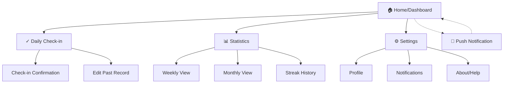
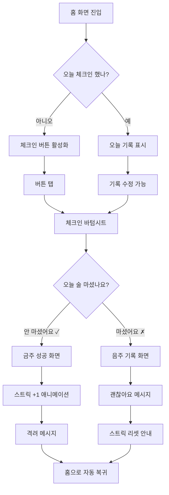
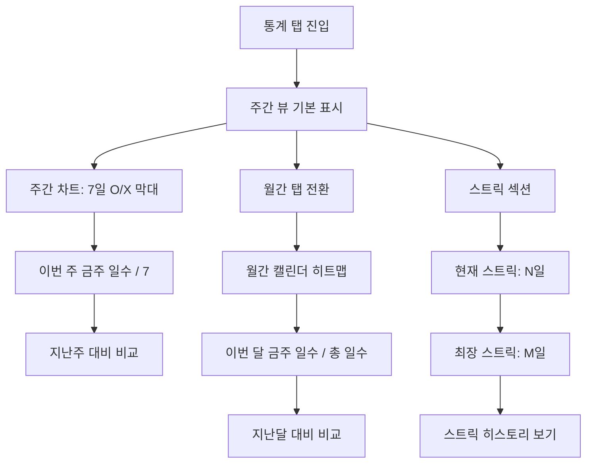
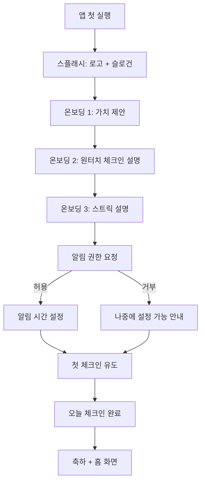
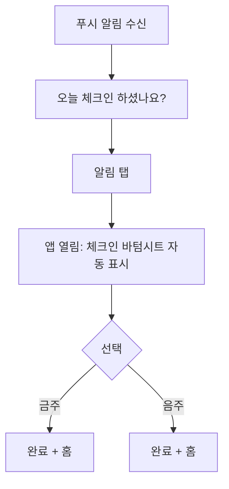

# Drinky UI/UX Specification

**Version:** 1.0
**Date:** 2026-01-24
**Author:** Sally (UX Expert)
**Status:** Draft - Pending Review

---

## Table of Contents

1. [Introduction](#1-introduction)
2. [Information Architecture](#2-information-architecture)
3. [User Flows](#3-user-flows)
4. [Wireframes & Mockups](#4-wireframes--mockups)
5. [Component Library](#5-component-library--design-system)
6. [Branding & Style Guide](#6-branding--style-guide)
7. [Accessibility Requirements](#7-accessibility-requirements)
8. [Responsiveness Strategy](#8-responsiveness-strategy)
9. [Animation & Micro-interactions](#9-animation--micro-interactions)
10. [Performance Considerations](#10-performance-considerations)
11. [Next Steps](#11-next-steps--design-handoff)

---

## 1. Introduction

This document defines the user experience goals, information architecture, user flows, and visual design specifications for **Drinky**'s user interface. It serves as the foundation for visual design and frontend development, ensuring a cohesive and user-centered experience.

### 1.1 Overall UX Goals & Principles

#### Target User Personas

| Persona | Profile | Primary Need | Emotional State |
|---------|---------|--------------|-----------------|
| **건강 경고 40대** | 직장인, 건강검진에서 간 수치 경고, 가족 있음 | 간편하게 기록, 명확한 목표 | 절박함 + 가족에 대한 책임감 |
| **회식 많은 20-30대** | 신입~대리급, 회식 문화, 건강/다이어트 관심 | 사회생활과 건강의 균형 | 부담 없이 관리하고 싶음 |
| **자녀 있는 30대** | 어린 자녀의 부모, 퇴근 후 음주 습관 | 좋은 롤모델이 되고 싶음 | 아이에게 보여줄 모습 걱정 |

#### Usability Goals

1. **Ease of learning:** 신규 사용자가 30초 내에 첫 체크인 완료
2. **Efficiency of use:** 원터치(1탭)로 일일 기록 완료
3. **Error prevention:** 실수로 잘못 체크해도 7일 내 수정 가능, 확인 다이얼로그
4. **Emotional safety:** 스트릭 깨져도 좌절감 대신 격려 제공

#### Design Principles

1. **간편함 우선 (Simplicity First)** - 1초 체크인, 복잡한 입력 없음
2. **격려하는 톤 (Encouraging Tone)** - 실패해도 "괜찮아요, 다시 시작해봐요!"
3. **점진적 공개 (Progressive Disclosure)** - 핵심 정보(스트릭, 체크인)만 먼저, 상세는 탐색 시
4. **시각적 성취감 (Visual Achievement)** - 스트릭, 차트로 진전 시각화
5. **부담 없는 사회적 요소 (Optional Social)** - 공유는 선택적, 절대 강제하지 않음

### 1.2 Change Log

| Date | Version | Description | Author |
|------|---------|-------------|--------|
| 2026-01-24 | 1.0 | 초기 문서 작성 | Sally (UX Expert) |

---

## 2. Information Architecture

### 2.1 Site Map / Screen Inventory



**Screen Count:** 10 screens (MVP)

| Screen | Priority | Description |
|--------|----------|-------------|
| Home/Dashboard | P0 | 스트릭 + 원터치 체크인 |
| Daily Check-in | P0 | O/X 선택 모달/바텀시트 |
| Check-in Confirmation | P0 | 체크인 결과 + 격려 메시지 |
| Weekly Statistics | P0 | 주간 음주 패턴 차트 |
| Monthly Statistics | P1 | 월간 음주 패턴 차트 |
| Streak History | P1 | 역대 스트릭 기록 |
| Edit Past Record | P1 | 7일 내 기록 수정 |
| Settings | P1 | 알림, 프로필 설정 |
| Notifications Settings | P1 | 푸시 알림 시간/빈도 |
| Onboarding | P0 | 첫 실행 시 간단 안내 |

### 2.2 Navigation Structure

**Primary Navigation:** Bottom Tab Bar (3 tabs)

| Tab | Icon | Label | Screen |
|-----|------|-------|--------|
| 1 | 🏠 | 홈 | Dashboard |
| 2 | 📊 | 통계 | Statistics |
| 3 | ⚙️ | 설정 | Settings |

**Secondary Navigation:**
- Statistics 내부: Segmented Control (주간/월간 전환)
- Settings 내부: List-based navigation

**Breadcrumb Strategy:**
- 사용하지 않음 - 깊이가 2단계를 넘지 않으므로 불필요
- 뒤로가기는 화면 상단 좌측 화살표 또는 제스처로 처리

---

## 3. User Flows

### 3.1 Daily Check-in (Core Flow)

**User Goal:** 오늘 술을 마셨는지/안 마셨는지 기록하기

**Entry Points:**
- 홈 화면 중앙 체크인 버튼
- 푸시 알림 탭
- 위젯 (향후)

**Success Criteria:**
- 1탭으로 체크인 완료
- 격려 메시지 확인
- 스트릭 업데이트 확인



**Edge Cases & Error Handling:**
- 자정 직전 체크인 → 서버 시간 기준으로 날짜 판정, 사용자에게 "오늘(1/24) 기록입니다" 명시
- 네트워크 오류 → 로컬 저장 후 재연결 시 동기화, "저장됨 ✓" 표시
- 실수로 잘못 체크 → 같은 날 내 무제한 수정 가능, 이전 날은 7일까지만
- 앱 강제 종료 → 체크인 도중이면 저장 안 됨, 다시 시도 유도

### 3.2 View Statistics

**User Goal:** 내 음주 패턴을 파악하고 진전을 확인하기

**Entry Points:**
- 하단 탭 "통계"
- 홈 화면 스트릭 카드 탭

**Success Criteria:**
- 주간/월간 음주 일수 확인
- 현재 스트릭 vs 최장 스트릭 비교
- 패턴 인사이트 확인



**Edge Cases & Error Handling:**
- 데이터 없음 (신규 사용자) → "첫 기록을 시작해보세요!" CTA 표시
- 부분 데이터 (중간에 빠진 날) → 빈 날은 회색 표시, "기록 없음"
- 과거 데이터 로딩 느림 → 스켈레톤 UI + 현재 주 먼저 표시

### 3.3 First-Time Onboarding

**User Goal:** 앱이 뭔지 이해하고 첫 체크인까지 완료하기

**Entry Points:**
- 앱 첫 설치/실행

**Success Criteria:**
- 30초 내 온보딩 완료
- 첫 체크인 완료
- 알림 권한 획득



**Edge Cases & Error Handling:**
- 온보딩 중 앱 종료 → 다음 실행 시 이어서 진행
- 알림 거부 → 설정에서 언제든 변경 가능함을 명시, 절대 재촉하지 않음
- Skip 버튼 → 온보딩 3장 모두 스킵 가능, 바로 홈으로

### 3.4 Push Notification Response

**User Goal:** 알림을 통해 빠르게 체크인하기

**Entry Points:**
- 푸시 알림 탭

**Success Criteria:**
- 알림 → 체크인 완료까지 2탭 이내



---

## 4. Wireframes & Mockups

### 4.1 Design Files

**Primary Design Files:** To be created in Figma (recommended)

### 4.2 Key Screen Layouts

#### Screen 1: Home / Dashboard

**Purpose:** 스트릭 확인 + 원터치 체크인 (앱의 핵심 화면)

```
┌─────────────────────────────┐
│  ≡        Drinky        ⚙️  │  ← Header (minimal)
├─────────────────────────────┤
│                             │
│     오늘도 함께해요 👋       │  ← Greeting (time-based)
│                             │
│  ┌───────────────────────┐  │
│  │                       │  │
│  │      🔥 12일째        │  │  ← Streak Card (hero)
│  │     연속 금주 중!      │  │
│  │                       │  │
│  │   최장 기록: 21일      │  │
│  └───────────────────────┘  │
│                             │
│                             │
│     ┌─────────────────┐     │
│     │                 │     │
│     │   오늘 체크인    │     │  ← Primary CTA Button
│     │       ✓         │     │     (large, centered)
│     │                 │     │
│     └─────────────────┘     │
│                             │
│    1/24 (금) 아직 기록 없음   │  ← Today's status
│                             │
├─────────────────────────────┤
│   🏠        📊        ⚙️    │  ← Bottom Tab Bar
│   홈        통계      설정   │
└─────────────────────────────┘
```

**Key Elements:**
- 스트릭 카드: 화면 상단 1/3, 큰 숫자로 성취감 강조
- 체크인 버튼: 화면 중앙, 엄지손가락 도달 최적 위치
- 오늘 상태: 체크인 전/후 상태 명확히 표시
- 하단 탭: 3개 탭, 현재 탭 강조

#### Screen 2: Check-in Bottom Sheet

**Purpose:** O/X 선택으로 오늘 음주 여부 기록

```
┌─────────────────────────────┐
│                             │
│      (Home Screen Dim)      │
│                             │
├─────────────────────────────┤  ← Bottom Sheet
│         ─────               │  ← Drag handle
│                             │
│     오늘 술 마셨나요?        │  ← Question
│      1월 24일 (금)          │
│                             │
│  ┌──────────┐ ┌──────────┐  │
│  │          │ │          │  │
│  │    ✗     │ │    ✓     │  │  ← Two large buttons
│  │  마셨어요 │ │ 안 마셨어요│  │
│  │          │ │          │  │
│  └──────────┘ └──────────┘  │
│                             │
│         나중에 할게요        │  ← Dismiss link
│                             │
└─────────────────────────────┘
```

#### Screen 3: Check-in Success (금주)

**Purpose:** 금주 성공 축하 + 스트릭 업데이트 확인

```
┌─────────────────────────────┐
│                             │
│      (Home Screen Dim)      │
│                             │
├─────────────────────────────┤
│         ─────               │
│                             │
│           🎉                │  ← Celebration icon
│                             │
│        대단해요!            │  ← Encouraging message
│     오늘도 금주 성공!        │
│                             │
│  ┌───────────────────────┐  │
│  │    🔥 13일째 (+1)     │  │  ← Updated streak
│  │                       │  │     with animation
│  └───────────────────────┘  │
│                             │
│   "건강한 오늘이 행복한      │  ← Motivational quote
│    내일을 만들어요"          │     (rotating)
│                             │
│     ┌─────────────────┐     │
│     │      확인       │     │  ← Confirm button
│     └─────────────────┘     │
│                             │
└─────────────────────────────┘
```

#### Screen 4: Check-in Result (음주)

**Purpose:** 음주 기록 + 격려 (절대 비난하지 않음)

```
┌─────────────────────────────┐
│                             │
│      (Home Screen Dim)      │
│                             │
├─────────────────────────────┤
│         ─────               │
│                             │
│           💪                │  ← Supportive icon
│                             │
│        괜찮아요!            │  ← Non-judgmental
│      기록하는 것만으로       │
│       대단한 거예요         │
│                             │
│   스트릭이 초기화되었지만    │  ← Honest but kind
│   새로운 시작을 응원해요!    │
│                             │
│   ┌─────────────────────┐   │
│   │ 💡 Tip: 내일은 물    │   │  ← Helpful tip
│   │    한 잔 더 마셔보세요 │   │     (optional)
│   └─────────────────────┘   │
│                             │
│     ┌─────────────────┐     │
│     │   새로운 시작    │     │  ← Positive framing
│     └─────────────────┘     │
│                             │
└─────────────────────────────┘
```

#### Screen 5: Statistics (Weekly View)

**Purpose:** 주간 음주 패턴 시각화

```
┌─────────────────────────────┐
│  ←        통계              │
├─────────────────────────────┤
│                             │
│   ┌──────────┬──────────┐   │
│   │   주간   │   월간   │   │  ← Segmented control
│   └──────────┴──────────┘   │
│                             │
│   1월 3주차 (1/20 - 1/26)   │  ← Week indicator
│        <  ●●●○  >          │  ← Week navigation
│                             │
│  ┌───────────────────────┐  │
│  │ █                     │  │
│  │ █   █       █   █     │  │  ← Bar chart
│  │ █   █   █   █   █     │  │     (green=금주)
│  │ ░   ░   ░   ░   ░   ░ │  │     (gray=음주)
│  │ 월  화  수  목  금  토 일│  │
│  └───────────────────────┘  │
│                             │
│   이번 주: 5일 / 7일 금주    │  ← Summary
│   지난주보다 2일 더! 🎉     │  ← Comparison
│                             │
│  ┌───────────────────────┐  │
│  │  🔥 현재 스트릭: 3일   │  │
│  │  🏆 최장 스트릭: 21일  │  │  ← Streak summary
│  └───────────────────────┘  │
│                             │
├─────────────────────────────┤
│   🏠        📊        ⚙️    │
│   홈        통계      설정   │
└─────────────────────────────┘
```

---

## 5. Component Library / Design System

### 5.1 Design System Approach

**Approach:** Custom lightweight design system built on top of **Tailwind CSS**

**Rationale:**
- PWA/모바일 웹 환경에 최적화된 유틸리티 기반 스타일링
- 빠른 프로토타이핑 + 일관된 스타일 유지
- 기존 컴포넌트 라이브러리(MUI, Chakra) 대비 번들 사이즈 최소화

### 5.2 Core Components

#### Button

| Variant | Use Case | Style |
|---------|----------|-------|
| `primary` | 주요 CTA (체크인 버튼) | 채움, 브랜드 컬러 |
| `secondary` | 보조 액션 | 테두리만, 브랜드 컬러 |
| `ghost` | 텍스트 링크형 | 배경 없음, 텍스트만 |
| `success` | 금주 선택 | 채움, 성공 컬러(초록) |
| `neutral` | 음주 선택 | 채움, 중립 컬러(회색) |

**Sizes:**

| Size | Height | Use Case |
|------|--------|----------|
| `sm` | 36px | 보조 버튼, 인라인 |
| `md` | 44px | 일반 버튼 |
| `lg` | 56px | 주요 CTA, 체크인 |
| `xl` | 72px | 체크인 O/X 버튼 |

#### Card

| Variant | Use Case | Style |
|---------|----------|-------|
| `elevated` | 스트릭 카드 (강조) | 그림자 + 배경 |
| `outlined` | 일반 정보 카드 | 테두리만 |
| `filled` | 팁/안내 카드 | 배경색 채움 |

#### Bottom Sheet

| Variant | Height | Use Case |
|---------|--------|----------|
| `compact` | 30% | 간단한 선택 (체크인) |
| `half` | 50% | 중간 복잡도 |
| `full` | 90% | 복잡한 폼 (향후) |

#### Chart

| Variant | Use Case |
|---------|----------|
| `bar-weekly` | 주간 7일 막대 |
| `calendar-heatmap` | 월간 캘린더 |

**Color Coding:**

| Status | Color | Meaning |
|--------|-------|---------|
| 금주 | `success-500` (초록) | 술 안 마신 날 |
| 음주 | `neutral-300` (회색) | 술 마신 날 |
| 미기록 | `neutral-100` (연한 회색) | 기록 없는 날 |

#### Streak Display

| Variant | Use Case | Style |
|---------|----------|-------|
| `hero` | 홈 화면 메인 | 큰 숫자 + 불꽃 아이콘 |
| `compact` | 통계 화면 내 | 작은 인라인 표시 |
| `badge` | 성취 뱃지 (향후) | 원형 뱃지 |

#### Tab Bar (Bottom Navigation)

| Property | Value |
|----------|-------|
| Height | 56px + safe area |
| Icon size | 24px |
| Label size | 12px |

#### Toast / Snackbar

| Variant | Use Case | Duration |
|---------|----------|----------|
| `success` | 저장 완료, 체크인 완료 | 3초 |
| `error` | 네트워크 오류 | 5초 + 액션 |
| `info` | 일반 안내 | 3초 |

### 5.3 Component Priority

| Component | Priority | Complexity | Sprint |
|-----------|----------|------------|--------|
| Button | P0 | Low | 1 |
| Card | P0 | Low | 1 |
| Bottom Sheet | P0 | Medium | 1 |
| Streak Display | P0 | Low | 1 |
| Tab Bar | P0 | Low | 1 |
| Chart (Weekly) | P1 | Medium | 2 |
| Chart (Monthly) | P1 | Medium | 2 |
| Toast | P1 | Low | 2 |

---

## 6. Branding & Style Guide

### 6.1 Visual Identity

**Brand Personality:**

| Attribute | Expression |
|-----------|------------|
| **Warm** | 따뜻한 컬러 톤, 둥근 모서리 |
| **Encouraging** | 긍정적 메시지, 축하 애니메이션 |
| **Simple** | 미니멀 UI, 여백 활용 |
| **Trustworthy** | 깔끔한 타이포, 일관된 패턴 |
| **Non-judgmental** | 중립적 톤, 절대 비난하지 않음 |

**Brand Essence:** "더 오래, 더 함께" - 건강한 삶을 통해 사랑하는 사람들과 더 오래 함께하기

### 6.2 Color Palette

#### Primary Colors

| Color Type | Name | Hex Code | Usage |
|------------|------|----------|-------|
| **Primary** | Warm Coral | `#FF6B6B` | 브랜드 강조, CTA 버튼, 활성 탭 |
| **Primary Light** | Soft Coral | `#FFE5E5` | 배경 강조, 호버 상태 |
| **Primary Dark** | Deep Coral | `#E85555` | 눌림 상태, 텍스트 강조 |

#### Secondary Colors

| Color Type | Name | Hex Code | Usage |
|------------|------|----------|-------|
| **Secondary** | Calm Blue | `#4ECDC4` | 보조 강조, 정보성 요소 |
| **Secondary Light** | Soft Teal | `#E0F7F5` | 정보 카드 배경 |

#### Semantic Colors

| Color Type | Name | Hex Code | Usage |
|------------|------|----------|-------|
| **Success** | Fresh Green | `#51CF66` | 금주 성공, 긍정 피드백, 차트 금주일 |
| **Success Light** | Soft Green | `#E8F7EA` | 성공 메시지 배경 |
| **Warning** | Warm Amber | `#FFB84D` | 주의 안내, 중요 공지 |
| **Warning Light** | Soft Amber | `#FFF4E0` | 경고 카드 배경 |
| **Error** | Soft Red | `#FF8787` | 에러 메시지 (부드럽게) |
| **Error Light** | Pale Red | `#FFE8E8` | 에러 배경 |

#### Neutral Colors

| Color Type | Name | Hex Code | Usage |
|------------|------|----------|-------|
| **Neutral 900** | Charcoal | `#212529` | 본문 텍스트 |
| **Neutral 700** | Dark Gray | `#495057` | 보조 텍스트 |
| **Neutral 500** | Medium Gray | `#868E96` | 비활성 텍스트, 플레이스홀더 |
| **Neutral 300** | Light Gray | `#DEE2E6` | 테두리, 구분선 |
| **Neutral 100** | Off White | `#F8F9FA` | 배경, 카드 배경 |
| **Neutral 0** | White | `#FFFFFF` | 기본 배경, 카드 |

### 6.3 Typography

#### Font Families

| Type | Font | Fallback | Usage |
|------|------|----------|-------|
| **Primary (Korean)** | Pretendard | -apple-system, sans-serif | 모든 UI 텍스트 |
| **Secondary (English)** | Inter | Pretendard, sans-serif | 숫자, 영문 |

#### Type Scale

| Element | Size | Weight | Line Height | Usage |
|---------|------|--------|-------------|-------|
| **Display** | 48px | 700 | 1.1 | 스트릭 숫자 |
| **H1** | 28px | 700 | 1.3 | 화면 제목 |
| **H2** | 22px | 600 | 1.35 | 섹션 제목 |
| **H3** | 18px | 600 | 1.4 | 카드 제목 |
| **Body Large** | 17px | 400 | 1.5 | 주요 본문 |
| **Body** | 15px | 400 | 1.5 | 일반 본문 |
| **Body Small** | 13px | 400 | 1.45 | 보조 설명 |
| **Caption** | 12px | 500 | 1.4 | 라벨, 캡션 |
| **Tab Label** | 11px | 500 | 1.3 | 하단 탭 라벨 |

### 6.4 Iconography

**Icon Library:** Lucide Icons

**Core Icons:**

| Icon | Name | Usage |
|------|------|-------|
| 🏠 | `home` | 홈 탭 |
| 📊 | `bar-chart-2` | 통계 탭 |
| ⚙️ | `settings` | 설정 탭 |
| ✓ | `check` | 금주 체크, 성공 |
| ✗ | `x` | 음주 체크, 닫기 |
| 🔥 | `flame` | 스트릭 |
| ← | `arrow-left` | 뒤로가기 |
| 🔔 | `bell` | 알림 |

**Specifications:**

| Property | Value |
|----------|-------|
| Default Size | 24px |
| Small Size | 20px |
| Large Size | 32px |
| Stroke Width | 2px |

### 6.5 Spacing & Layout

#### Spacing Scale (4px Base)

| Token | Value | Usage |
|-------|-------|-------|
| `space-1` | 4px | 최소 간격, 인라인 요소 |
| `space-2` | 8px | 아이콘-텍스트, 밀접한 요소 |
| `space-3` | 12px | 관련 요소 그룹 내 |
| `space-4` | 16px | 카드 내부 패딩, 기본 간격 |
| `space-5` | 20px | 섹션 간 간격 |
| `space-6` | 24px | 큰 섹션 간 간격 |
| `space-8` | 32px | 화면 상단/하단 여백 |

#### Grid System

**Mobile (기본):**

| Property | Value |
|----------|-------|
| Columns | 4 |
| Gutter | 16px |
| Margin | 16px |

**Tablet (768px+):**

| Property | Value |
|----------|-------|
| Columns | 8 |
| Gutter | 24px |
| Margin | 24px |
| Max Width | 600px (centered) |

#### Border Radius

| Token | Value | Usage |
|-------|-------|-------|
| `rounded-sm` | 4px | 작은 요소, 뱃지 |
| `rounded-md` | 8px | 버튼, 입력 필드 |
| `rounded-lg` | 12px | 카드 |
| `rounded-xl` | 16px | 바텀시트 상단 |
| `rounded-full` | 9999px | 원형 버튼, 아바타 |

#### Shadows

| Token | Value | Usage |
|-------|-------|-------|
| `shadow-sm` | 0 1px 2px rgba(0,0,0,0.05) | 미세한 깊이감 |
| `shadow-md` | 0 4px 6px rgba(0,0,0,0.07) | 카드, 떠있는 요소 |
| `shadow-lg` | 0 10px 15px rgba(0,0,0,0.1) | 바텀시트, 모달 |

---

## 7. Accessibility Requirements

### 7.1 Compliance Target

**Standard:** WCAG 2.1 Level AA

### 7.2 Key Requirements

#### Visual

**Color Contrast:**

| Element | Minimum Ratio | Status |
|---------|---------------|--------|
| 본문 텍스트 (Neutral 900 on White) | 4.5:1 | ✅ 16:1 |
| 보조 텍스트 (Neutral 700 on White) | 4.5:1 | ✅ 7.5:1 |
| 버튼 텍스트 (White on Primary) | 3:1 (Large) | ✅ 3.8:1 |

**Focus Indicators:**

| Requirement | Specification |
|-------------|---------------|
| Focus ring 색상 | Primary (#FF6B6B) |
| Focus ring 두께 | 2px |
| Focus ring offset | 2px |

**Text Sizing:**

| Requirement | Specification |
|-------------|---------------|
| 최소 폰트 크기 | 12px |
| 권장 본문 크기 | 15-17px |
| 텍스트 확대 지원 | 200%까지 |

#### Interaction

**Keyboard Navigation:**

| Requirement | Specification |
|-------------|---------------|
| Tab 이동 | 논리적 순서, 좌→우, 상→하 |
| Enter/Space | 버튼/링크 활성화 |
| Escape | 바텀시트/모달 닫기 |

**Touch Targets:**

| Requirement | Specification |
|-------------|---------------|
| 최소 터치 영역 | 44 x 44px (WCAG), 48 x 48px (권장) |
| 터치 타겟 간 간격 | 최소 8px |

**Screen Reader Support:**

| Element | ARIA Implementation |
|---------|---------------------|
| 체크인 버튼 | `aria-label="오늘 음주 여부 체크인"` |
| 스트릭 카드 | `aria-label="현재 12일 연속 금주 중, 최장 기록 21일"` |
| 바텀시트 | `role="dialog"` + `aria-modal="true"` |
| 성공 메시지 | `role="alert"` + `aria-live="polite"` |

#### Content

**Heading Structure:**
- h1 → h2 → h3 순서 준수
- 건너뛰기 금지
- 랜드마크 사용: `<main>`, `<nav>`, `<header>`

### 7.3 Reduced Motion Support

```css
@media (prefers-reduced-motion: reduce) {
  *, *::before, *::after {
    animation-duration: 0.01ms !important;
    transition-duration: 0.01ms !important;
  }
}
```

### 7.4 Testing Strategy

**Automated:**
- axe-core: Jest 테스트에 통합
- Lighthouse: CI/CD 파이프라인
- eslint-plugin-jsx-a11y: 개발 시 실시간

**Manual:**
- 키보드만으로 전체 플로우 (매 스프린트)
- VoiceOver/TalkBack 테스트 (매 릴리즈)
- 색맹 시뮬레이션 (디자인 단계)

---

## 8. Responsiveness Strategy

### 8.1 Breakpoints

| Breakpoint | Min Width | Max Width | Target Devices |
|------------|-----------|-----------|----------------|
| **Mobile (Default)** | 0px | 479px | 스마트폰 세로 모드 |
| **Mobile Large** | 480px | 767px | 큰 스마트폰, 가로 모드 |
| **Tablet** | 768px | 1023px | iPad, Android 태블릿 |
| **Desktop** | 1024px | - | 데스크톱 브라우저 |

### 8.2 Adaptation Patterns

#### Layout Changes

| Element | Mobile (Default) | Tablet (md) | Desktop (lg) |
|---------|------------------|-------------|--------------|
| 컨텐츠 최대 너비 | 100% | 600px (centered) | 480px (centered) |
| 화면 마진 | 16px | 24px | auto (centered) |
| 카드 패딩 | 16px | 20px | 24px |

#### Navigation Changes

| Element | Mobile | Tablet | Desktop |
|---------|--------|--------|---------|
| Bottom Tab Bar | ✅ 표시 | ✅ 표시 | ✅ 표시 (또는 사이드바) |
| Tab Bar 높이 | 56px + safe area | 56px | 48px |

#### Interaction Changes

| Interaction | Mobile | Desktop |
|-------------|--------|---------|
| 체크인 | 탭 | 클릭 |
| 바텀시트 닫기 | 스와이프 다운 | X 버튼 + 외부 클릭 |
| 주간 이동 | 스와이프 좌우 | 화살표 버튼 |

### 8.3 Safe Area Handling

```css
.screen {
  padding-top: env(safe-area-inset-top);
  padding-bottom: env(safe-area-inset-bottom);
}

.tab-bar {
  padding-bottom: calc(8px + env(safe-area-inset-bottom));
}
```

### 8.4 Testing Matrix

| Device | Resolution | Priority |
|--------|------------|----------|
| iPhone SE | 375 x 667 | 🔴 High |
| iPhone 14 | 390 x 844 | 🔴 High |
| Galaxy S21 | 360 x 800 | 🔴 High |
| iPad Mini | 768 x 1024 | 🟡 Medium |
| Desktop 1080p | 1920 x 1080 | 🟢 Low |

---

## 9. Animation & Micro-interactions

### 9.1 Motion Principles

| Principle | Description |
|-----------|-------------|
| **기능적 움직임** | 애니메이션은 장식이 아닌 피드백과 안내 목적 |
| **빠르고 가볍게** | 사용자를 기다리게 하지 않음, 200-400ms 이내 |
| **자연스러운 물리** | 현실 세계의 움직임 모방 (ease-out 선호) |
| **절제된 축하** | 과하지 않은 성취감 표현 |
| **접근성 우선** | Reduced motion 완전 지원 |

### 9.2 Easing Functions

| Name | CSS Value | Use Case |
|------|-----------|----------|
| **Ease Out** | `cubic-bezier(0.0, 0.0, 0.2, 1)` | 등장 애니메이션 |
| **Ease In** | `cubic-bezier(0.4, 0.0, 1, 1)` | 퇴장 애니메이션 |
| **Spring** | `cubic-bezier(0.34, 1.56, 0.64, 1)` | 성공 애니메이션 |

### 9.3 Duration Scale

| Token | Duration | Use Case |
|-------|----------|----------|
| `instant` | 100ms | 호버, 포커스 |
| `fast` | 150ms | 버튼 눌림 |
| `normal` | 200ms | 일반 전환 |
| `moderate` | 300ms | 바텀시트 |
| `emphasis` | 500ms | 성공 카운트업 |

### 9.4 Key Animations

| Animation | Trigger | Duration | Notes |
|-----------|---------|----------|-------|
| Button Press | 탭/클릭 | 100ms | scale(0.96) |
| Bottom Sheet Slide | 체크인 버튼 | 300ms | translateY |
| Success Celebration | 금주 체크인 | 1500ms total | Confetti + 카운트업 |
| Support Message | 음주 체크인 | 500ms total | 차분한 fade |
| Streak Count Up | 숫자 변경 | 500ms | 카운팅 애니메이션 |
| Chart Bars | 통계 진입 | 400ms + stagger | scaleY |

### 9.5 Check-in Success Animation Sequence

1. Content Fade (0-150ms)
2. Success Icon + Message (150-400ms) - spring easing
3. Streak Count Up (400-900ms)
4. Confetti (400-1500ms) - 20-30 particles

### 9.6 Reduced Motion Alternatives

| Animation | Reduced Motion |
|-----------|----------------|
| Button Press | 색상 변화만 |
| Bottom Sheet Slide | 즉시 표시 |
| Success Confetti | 제거 |
| Streak Count Up | 즉시 최종 숫자 |

---

## 10. Performance Considerations

### 10.1 Performance Goals

| Metric | Target | Minimum |
|--------|--------|---------|
| **First Contentful Paint (FCP)** | < 1.0s | < 1.8s |
| **Largest Contentful Paint (LCP)** | < 1.5s | < 2.5s |
| **Time to Interactive (TTI)** | < 2.0s | < 3.5s |
| **Cumulative Layout Shift (CLS)** | < 0.05 | < 0.1 |
| **Total Bundle Size** | < 150kb | < 250kb |
| **Interaction Response** | < 100ms | < 200ms |
| **Animation FPS** | 60fps | 30fps |

### 10.2 Bundle Size Budget

| Category | Budget |
|----------|--------|
| Framework (React/Next.js) | ~45kb |
| UI Components | ~20kb |
| Tailwind CSS | ~10kb |
| Chart Library (lazy) | ~30kb |
| Confetti (lazy) | ~3kb |
| Icons (Lucide) | ~5kb |
| Buffer | ~37kb |
| **Total** | **< 150kb** |

### 10.3 Design Strategies

#### Skeleton UI
- 통계 차트 로딩 시
- 스트릭 데이터 패칭 시

#### Optimistic Updates
- 체크인 즉시 UI 업데이트
- 백그라운드에서 서버 저장
- 실패 시 롤백 + 에러 토스트

#### Font Loading
- `font-display: swap`
- Size-adjusted fallback
- Preload critical fonts

#### Caching (PWA)

| Resource | Strategy |
|----------|----------|
| HTML Shell | Network First |
| JS/CSS Bundles | Cache First |
| Fonts | Cache First (1 year) |
| API Responses | Network First + Cache Fallback |

### 10.4 Offline Support

- 앱 Shell 로드: ✅ 캐시됨
- 이전 데이터 표시: ✅ IndexedDB
- 체크인 기록: ✅ 오프라인 저장 → 온라인 시 동기화

---

## 11. Next Steps & Design Handoff

### 11.1 Immediate Actions

1. **문서 리뷰 및 승인** - 이해관계자와 본 스펙 리뷰
2. **디자인 파일 생성** - Figma에서 고해상도 목업 제작
3. **기술 스파이크 진행** - 바텀시트, 차트 라이브러리 검증
4. **프론트엔드 아키텍처 문서 작성**
5. **접근성 검증 준비**

### 11.2 Design Handoff Checklist

#### 완료 항목

- ✅ 사용자 페르소나 정의
- ✅ 유저빌리티 목표 정의
- ✅ 디자인 원칙 정의
- ✅ 정보 구조 (IA) 정의
- ✅ 핵심 사용자 플로우
- ✅ 와이어프레임
- ✅ 컴포넌트 라이브러리
- ✅ 컬러 팔레트
- ✅ 타이포그래피
- ✅ 아이콘 시스템
- ✅ 스페이싱 & 레이아웃
- ✅ 접근성 요구사항
- ✅ 반응형 전략
- ✅ 애니메이션 명세
- ✅ 성능 목표

#### 추가 필요 항목

| Item | Priority | Owner |
|------|----------|-------|
| Figma 비주얼 디자인 | P0 | Designer |
| 에러 상태 화면 디자인 | P0 | UX |
| 빈 상태 (Empty State) 디자인 | P0 | UX |
| 온보딩 화면 상세 디자인 | P1 | UX |
| 푸시 알림 메시지 문구 정의 | P1 | PO |
| 격려 메시지 카피 라이팅 | P1 | PO |

### 11.3 Open Questions

| Question | Recommendation |
|----------|----------------|
| 바텀시트 vs 전체화면 모달? | 기술 스파이크 후 결정 |
| 탭 전환 애니메이션 필요? | Instant (빠른 전환) |
| Confetti 효과 범위? | 매일 (동기부여), 과하면 축소 |

### 11.4 Sprint 계획 제안

| Sprint | Focus | Deliverables |
|--------|-------|--------------|
| **Sprint 0** | 환경 설정 + 기초 | 프로젝트 셋업, 디자인 시스템, 기술 스파이크 |
| **Sprint 1** | 핵심 플로우 | 홈 화면, 체크인 플로우, 성공/실패 화면 |
| **Sprint 2** | 통계 + 알림 | 통계 화면, 차트, 푸시 알림 |
| **Sprint 3** | 온보딩 + 폴리싱 | 온보딩, 설정, 애니메이션 개선, QA |

---

*Document generated by Sally (UX Expert) using BMAD-METHOD*
