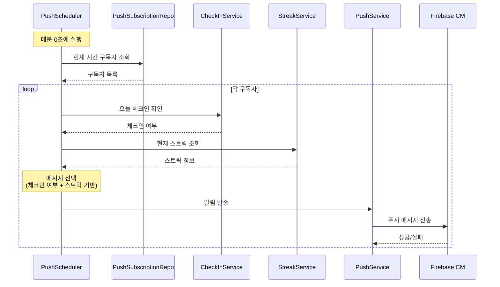

# Story 2.5: 푸시 알림 스케줄링 및 콘텐츠

## Status

**Draft**

---

## Story

**As a** 사용자,
**I want** 매일 설정한 시간에 격려 알림을 받을 수 있어서,
**so that** 잊지 않고 체크인하고 동기부여를 유지할 수 있다.

---

## Acceptance Criteria

1. Spring @Scheduled를 활용한 알림 스케줄링 (매분 실행, preferred_time 체크)
2. 기본 알림 시간 설정 (저녁 9시)
3. 격려 메시지 템플릿 (최소 10종):
   - "오늘 하루도 고생했어요! 체크인 해볼까요?"
   - "🔥 {N}일 연속 성공 중! 오늘도 화이팅!"
   - "건강한 선택이 쌓이고 있어요 💪"
4. 스트릭 기반 메시지 분기 (스트릭 0일 vs 7일+)
5. 오늘 이미 체크인한 경우 다른 메시지 ("오늘도 기록 완료! 대단해요")
6. 알림 발송 로그 저장

---

## Tasks / Subtasks

- [ ] **Task 1: PushScheduler 구현** (AC: 1)
  - [ ] `scheduler/PushScheduler.kt` 생성
  - [ ] `@Scheduled(cron = "0 * * * * *")` - 매분 실행
  - [ ] 현재 시간(분 단위)에 해당하는 구독자 조회
  - [ ] 배치 발송 처리

- [ ] **Task 2: 알림 대상 조회 쿼리** (AC: 1)
  - [ ] `PushSubscriptionRepository`에 쿼리 추가
    ```kotlin
    @Query("SELECT p FROM PushSubscription p WHERE p.preferredTime = :time AND p.isActive = true")
    fun findByPreferredTimeAndActive(time: LocalTime): List<PushSubscription>
    ```

- [ ] **Task 3: 메시지 템플릿 시스템** (AC: 3, 4)
  - [ ] `PushMessageTemplates.kt` 생성
  - [ ] 기본 메시지 (10종 이상)
  - [ ] 스트릭 기반 메시지 분기
    - [ ] 0일: 시작 독려 메시지
    - [ ] 1-6일: 초반 격려
    - [ ] 7-13일: 주간 달성 축하
    - [ ] 14일+: 장기 성공 칭찬
  - [ ] 메시지 랜덤 선택 로직

- [ ] **Task 4: 체크인 상태 확인** (AC: 5)
  - [ ] 알림 발송 전 오늘 체크인 여부 확인
  - [ ] 체크인 완료 시 다른 메시지 발송
  - [ ] 체크인 미완료 시 체크인 독려 메시지

- [ ] **Task 5: PushService 발송 로직 확장** (AC: 1, 6)
  - [ ] `sendScheduledNotification(subscription, message)` 메서드
  - [ ] 발송 실패 시 재시도 로직 (선택)
  - [ ] 토큰 무효화 시 구독 비활성화

- [ ] **Task 6: 알림 로그 테이블** (AC: 6)
  - [ ] `V5__create_notification_logs.sql` (선택사항)
    ```sql
    CREATE TABLE notification_logs (
        id UUID PRIMARY KEY DEFAULT uuid_generate_v4(),
        user_id UUID NOT NULL REFERENCES users(id),
        message_type VARCHAR(50) NOT NULL,
        status VARCHAR(20) NOT NULL,
        sent_at TIMESTAMP NOT NULL DEFAULT CURRENT_TIMESTAMP
    );
    ```
  - [ ] `NotificationLog` 엔티티 생성
  - [ ] 발송 성공/실패 로깅

- [ ] **Task 7: 설정 페이지 연동 준비** (AC: 2)
  - [ ] 기본 preferred_time: 21:00 (저녁 9시)
  - [ ] 시간 변경 API 준비 (Story 2.6에서 UI 구현)

---

## Dev Notes

### 프로젝트 구조 (이 스토리 관련)

```
src/main/kotlin/com/drinky/
├── scheduler/
│   └── PushScheduler.kt
├── service/
│   └── PushService.kt (확장)
└── util/
    └── PushMessageTemplates.kt

src/main/resources/db/migration/
└── V5__create_notification_logs.sql (선택)
```

### PushScheduler 예시

```kotlin
@Component
class PushScheduler(
    private val pushSubscriptionRepository: PushSubscriptionRepository,
    private val checkInService: CheckInService,
    private val streakService: StreakService,
    private val pushService: PushService
) {
    private val logger = LoggerFactory.getLogger(PushScheduler::class.java)

    @Scheduled(cron = "0 * * * * *") // 매분 실행
    fun sendScheduledNotifications() {
        val currentTime = LocalTime.now().withSecond(0).withNano(0)
        val subscriptions = pushSubscriptionRepository.findByPreferredTimeAndActive(currentTime)

        logger.info("Sending notifications for ${subscriptions.size} users at $currentTime")

        subscriptions.forEach { subscription ->
            try {
                sendNotificationToUser(subscription)
            } catch (e: Exception) {
                logger.error("Failed to send notification to user ${subscription.userId}", e)
            }
        }
    }

    private fun sendNotificationToUser(subscription: PushSubscription) {
        val userId = subscription.userId
        val todayCheckIn = checkInService.getTodayCheckIn(userId)
        val streak = streakService.getOrCreateStreak(userId)

        val (title, body) = if (todayCheckIn != null) {
            // 이미 체크인 완료
            PushMessageTemplates.getCompletedMessage(streak.currentStreak)
        } else {
            // 체크인 독려
            PushMessageTemplates.getReminderMessage(streak.currentStreak)
        }

        pushService.sendNotification(subscription.fcmToken, title, body)
    }
}
```

### 메시지 템플릿 예시

```kotlin
object PushMessageTemplates {

    // 체크인 독려 메시지 (미완료 사용자용)
    private val reminderMessages = mapOf(
        "new" to listOf(
            Pair("Drinky", "오늘 하루도 고생했어요! 체크인 해볼까요? 💪"),
            Pair("Drinky", "오늘의 기록을 남겨보세요 📝"),
            Pair("Drinky", "잠깐! 오늘 체크인 하셨나요? 🤔")
        ),
        "streak" to listOf(
            Pair("🔥 스트릭 진행 중!", "{N}일 연속 성공 중! 오늘도 이어가요!"),
            Pair("Drinky", "연속 {N}일째! 오늘도 화이팅! 💪"),
            Pair("Drinky", "대단해요! {N}일 연속! 오늘 체크인도 잊지 마세요 ✨")
        ),
        "milestone" to listOf(
            Pair("🏆 일주일 돌파!", "7일 연속 성공! 오늘도 기록해볼까요?"),
            Pair("🎉 2주 달성!", "14일이나 연속! 정말 대단해요!"),
            Pair("👑 한 달의 기적!", "30일 연속! 당신은 진정한 챔피언!")
        )
    )

    // 체크인 완료 메시지 (이미 체크인한 사용자용)
    private val completedMessages = listOf(
        Pair("오늘도 기록 완료! 👏", "꾸준함이 빛나요. 내일도 화이팅!"),
        Pair("잘하고 있어요! ✨", "오늘의 체크인 완료! 푹 쉬세요 😊"),
        Pair("대단해요! 🌟", "오늘도 건강한 선택을 했네요!")
    )

    fun getReminderMessage(currentStreak: Int): Pair<String, String> {
        return when {
            currentStreak == 0 -> reminderMessages["new"]!!.random()
            currentStreak == 7 || currentStreak == 14 || currentStreak == 30 ->
                reminderMessages["milestone"]!!
                    .random()
                    .let { Pair(it.first, it.second.replace("{N}", currentStreak.toString())) }
            currentStreak > 0 ->
                reminderMessages["streak"]!!
                    .random()
                    .let { Pair(it.first, it.second.replace("{N}", currentStreak.toString())) }
            else -> reminderMessages["new"]!!.random()
        }
    }

    fun getCompletedMessage(currentStreak: Int): Pair<String, String> {
        val base = completedMessages.random()
        return if (currentStreak > 7) {
            Pair("${currentStreak}일 연속! ${base.first}", base.second)
        } else {
            base
        }
    }
}
```

### 알림 발송 흐름



### 테스트용 수동 발송 API

```kotlin
@RestController
@RequestMapping("/api/push")
class PushAdminController(
    private val pushScheduler: PushScheduler
) {
    @PostMapping("/trigger")
    @PreAuthorize("hasRole('ADMIN')") // 또는 개발 환경에서만
    fun triggerManually(): ResponseEntity<String> {
        pushScheduler.sendScheduledNotifications()
        return ResponseEntity.ok("Triggered")
    }
}
```

---

## Testing

### 이 스토리의 테스트 요구사항

| 테스트 파일 | 테스트 내용 |
|------------|------------|
| `PushSchedulerTest.kt` | 스케줄러 로직, 조건별 메시지 선택 |
| `PushMessageTemplatesTest.kt` | 메시지 템플릿 랜덤 선택, 스트릭 치환 |

### 테스트 케이스

1. 설정 시간에 맞는 구독자만 조회
2. 체크인 완료 사용자에게 다른 메시지 발송
3. 스트릭 0일/7일+에 따른 메시지 분기
4. FCM 토큰 무효화 시 구독 비활성화

---

## Change Log

| Date | Version | Description | Author |
|------|---------|-------------|--------|
| 2026-01-24 | 0.1 | 스토리 초안 작성 | PO Sarah |

---

## Dev Agent Record

*(개발 에이전트가 구현 시 기록)*

---

## QA Results

*(QA 에이전트의 리뷰 결과)*
